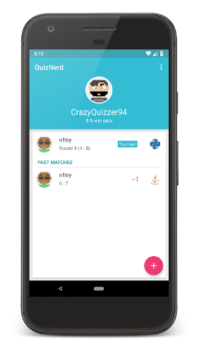
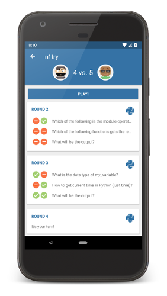
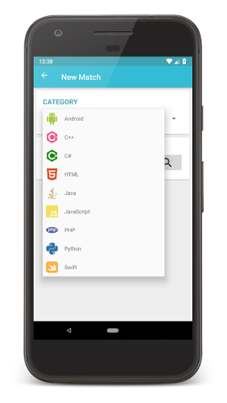
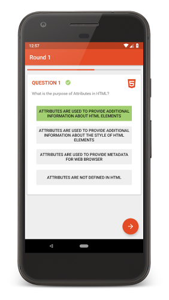
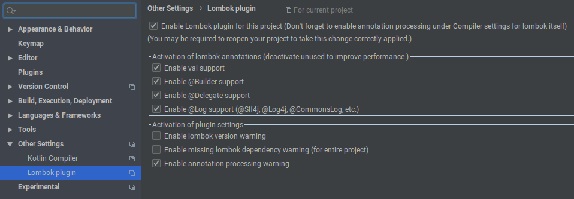

# quiznerd-android


My implementation of the final Capstone project from the [Udacity Android Developer Nanodegree Program](https://classroom.udacity.com/nanodegrees/nd801), which I was able to participate in thanks to a scholarship by Udacity and Google 🤗.

## 📱 Screenshots




## ✏️ Description
QuizNerd is a multiplayer coding quiz game developed for programmers and IT enthusiasts. You can challenge your friends, compete in matches and test your skills in various programming languages.

QuizNerd comprises over 800 different questions in 9 categories, including Android, C++, C#, HTML, Java, JavaScript, PHP, Python and Swift. 

## 🧪 Technology
The Udacity course gave some requirements and restrictions on the technology to use. Projects had to be implemented in native Android with Java and had to make use of at least two Google services / libraries. Therefore, the tech stack for this project is:

* **Language**: Java, Android SDK
* **Database**: Firebase Firestore
* **Authentication**: Firebase Auth
* **Backend Logic**: Firebase CloudFunctions
* **Major Libraries**s: Lombok, Butterknife, OkHttp, Gson

## ⚙️ How tun run?
1. Enable annotation pre-processing in Android Studio.
    1. Open *Preferences* (from the main screen - see screenshot below)
    2. Navigate to *Build, Execution, Deployment --> Compiler --> Annotation Processors*
    3. Check *Enable annotation processing*
2. Install [Project Lombok](https://projectlombok.org/) plugin in Android Studio (via *Preferences --> Plugins*)
3. Clone this project and open it in Android Studio
4. Add keystore file `quiznerd_keystore.jks` to project root
5. Insert keystore passwords in `app/build.gradle`
6. Run it or do `./.gradlew installRelease`



## 🗒 Developer Notes
* [Firebase project information](https://console.firebase.google.com/project/quiznerd-49e4f/settings/general/android:com.github.n1try.quiznerd) and `google-services.json`
* [Credentials](https://console.firebase.google.com/u/0/project/quiznerd-49e4f/settings/serviceaccounts/adminsdk)
* Create SHA1 fingerprint for Google login (see below) and add to [Firebase project settings](https://console.firebase.google.com/u/0/project/quiznerd-49e4f/settings/general/android:com.github.n1try.quiznerd)

```
# Debug
keytool -exportcert -list -v \
-alias androiddebugkey -keystore ~/.android/debug.keystore

# Release
keytool -exportcert -list -v \
-alias key0 -keystore quiznerd_keystore.jks

```

* Additionally, Google Play Store creates also a fingerprint [here](https://play.google.com/apps/publish/?account=6059045896101218926#KeyManagementPlace:p=com.github.n1try.quiznerd&appid=4972146644198950455)

## 📓 License
MIT